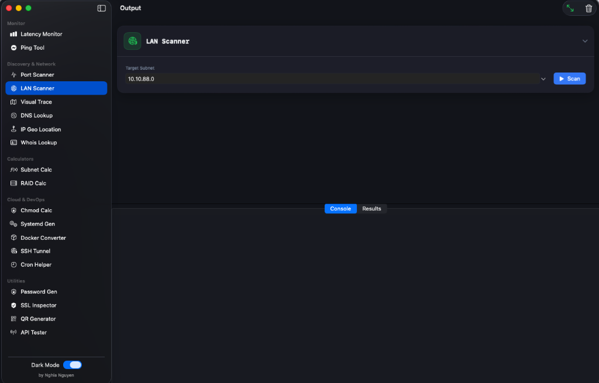

# SysOps Toolbox 🛠️


**SysOps Toolbox** is a comprehensive, native macOS application designed for System Administrators, DevOps Engineers, and Network Professionals. Built with **SwiftUI**, it combines essential network utilities, calculators, and cloud tools into a single, modern, and high-performance interface.

> **System Requirements**: macOS 14.0 (Sonoma) or later.



## ✨ Visual Feature Highlights

### 🖥️ Network Dashboard (New)
*Your central command center for network monitoring.*


| Feature | Description |
| :--- | :--- |
| **Real-time Bandwidth** | Smooth gradient area chart visualizing Download/Upload speeds in Mbps. |
| **Connectivity Grid** | 60-second history of connection stability (Green = Good, Red = Loss). |
| **Process Monitor** | Identify which apps are hogging your bandwidth instantly. |

---

### 📡 Network Discovery
*Scan, Map, and Analyze your network with precision.*

| **Live Latency Monitor** | **Visual Traceroute** |
| :---: | :---: |
|  | *Map network hops with geolocation data.* |
| Real-time ping monitoring to multiple targets (Google, Cloudflare, Gateway) with heartbeat graphs. | (Coming Soon: Visual Map Integration) |

---

### ☁️ Cloud & DevOps Tools
*Essential utilities for modern infrastructure management.*

| **Docker Converter** | **SSH Tunnel Builder** |
| :---: | :---: |
|  |  |
| Convert `docker run` to `docker-compose.yml` instantly. | Visual interface for Local/Remote Port Forwarding. |

---

### 🛡️ Security & Utilities
*   **SSL Inspector**: Analyze certificate chains and expiry dates. ``
*   **RAID Calculator**: Plan storage for RAID 0/1/5/6/10 & **ZFS RAID-Z**. ``
*   **Password Gen**: Create cryptographically secure passwords.
*   **Subnet Calc**: Visual CIDR and subnet division.

## 🪟 Windows Port (Coming Soon)
We are planning a native Windows version!
*   Documentation and Design Port prompts are available in `docs/windows_reference/`.
*   Includes `WINDOWS_PORT_PROMPT.md` for AI-assisted porting.

## 🚀 Installation

### Pre-built Binary
Download the latest `.dmg` or `.app` from the [Releases](https://github.com/nghianguyen98/sysops-toolbox/releases) page.

> **Note**: If you see "App is damaged", run this command in Terminal:
> `xattr -cr /Applications/SysOpsToolbox.app`

### Build from Source
Requirements:
*   macOS 14.0+
*   Xcode 15+

1.  Clone the repository:
    ```bash
    git clone https://github.com/nghianguyen98/sysops-toolbox.git
    cd sysops-toolbox/SysOpsToolbox
    ```
2.  Open the project:
    ```bash
    open SysOpsToolbox.xcodeproj
    ```
3.  Build and Run (`Cmd + R`).

## 🛠️ Tech Stack
*   **Language**: Swift 5
*   **UI Framework**: SwiftUI (MVVM)
*   **Connectivity**: Network.framework, Foundation
*   **Charts**: Swift Charts

## 🔮 Roadmap & Coming Soon
We are constantly working to improve SysOps Toolbox. Here are some exciting features on our roadmap:

*   **Packet Sniffer**: Capture and analyze network packets (pcap) directly from the UI.
*   **Cloud Manager**: Lightweight interface for AWS EC2/S3 and DigitalOcean Droplets.
*   **Webhook Debugger**: Local tunnel and inspector for incoming webhooks.
*   **Plugin System**: Community-driven extensions to add new tools.
*   **Cross-Platform Support**: Optimizing for iPadOS and Linux.

## 🤝 Contributing
Contributions are welcome! Please read [CONTRIBUTING.md](CONTRIBUTING.md) for details on our code of conduct, and the process for submitting pull requests.

## 📄 License
This project is licensed under the MIT License - see the [LICENSE](LICENSE) file for details.

---
*Crafted by Nghia Nguyen*
